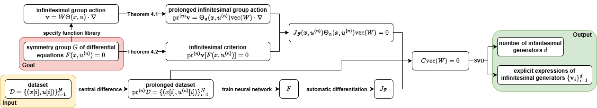

# Explicit Discovery of Nonlinear Symmetries from Dynamic Data

This repository is the official implementation of the paper Explicit Discovery of Nonlinear Symmetries from Dynamic Data (ICML 2025).



## Requirements

To install requirements:

```shell
pip install -r requirements.txt
```

To install Adan:

```shell
git clone https://github.com/sail-sg/Adan.git
cd Adan
python3 setup.py install --unfused
```

To download the top quark tagging dataset:

```shell
wget -P ./data/top https://zenodo.org/records/2603256/files/train.h5 https://zenodo.org/records/2603256/files/val.h5
```

To generate PDE datasets:

```shell
python -m data_utils.[pde] --n_ics 10
python -m data_utils.[pde] --n_ics 2 --save_name val --seed 1
python -m data_utils.[pde] --n_ics 2 --save_name test --seed 2
```

## Training

For the neural network training stage of LieNLSD, run:

```shell
# Top quark tagging
python main_train.py --task top --num_epochs 200 --hidden_dim 200 --n_layers 3 --activation ReLU --log_interval 1 --save_interval 10 --save_dir top --gpu [gpu]
# Burgers' equation
python main_train.py --task burger --num_epochs 200 --hidden_dim 200 --n_layers 3 --activation Sigmoid --log_interval 1 --save_interval 10 --save_dir burger --gpu [gpu]
# Wave equation
python main_train.py --task wave --num_epochs 100 --hidden_dim 200 --n_layers 3 --activation Sigmoid --log_interval 1 --save_interval 10 --save_dir wave --gpu [gpu]
# Schrodinger equation
python main_train.py --task schrodinger --num_epochs 500 --hidden_dim 200 --n_layers 3 --activation Sigmoid --log_interval 1 --save_interval 10 --save_dir schrodinger --gpu [gpu]
# Heat equation
python main_train.py --task heat --num_epochs 100 --hidden_dim 200 --n_layers 3 --activation Sigmoid --log_interval 1 --save_interval 10 --save_dir heat --gpu [gpu]
# KdV equation
python main_train.py --task kdv --num_epochs 200 --hidden_dim 200 --n_layers 3 --activation Sigmoid --log_interval 1 --save_interval 10 --save_dir kdv --gpu [gpu]
# Reaction-diffusion system
python main_train.py --task rd --num_epochs 200 --hidden_dim 200 --n_layers 3 --activation Sigmoid --log_interval 1 --save_interval 10 --save_dir rd --gpu [gpu]
```

## Symmetry Discovery

For the symmetry discovery stage of LieNLSD, run:

```shell
# Top quark tagging
python main_discovery.py --task top --epsilon1 1e-2 --epsilon2 1e-1 --hidden_dim 200 --n_layers 3 --activation ReLU --save_dir top --epoch [epoch] --threshold 10 --sample [sample] --gpu [gpu]
# Burgers' equation
python main_discovery.py --task burger --epsilon1 1e-4 --epsilon2 1e-4 --hidden_dim 200 --n_layers 3 --activation Sigmoid --save_dir burger --epoch [epoch] --threshold 0.2 --sample [sample] --gpu [gpu]
# Wave equation
python main_discovery.py --task wave --epsilon1 1e-4 --epsilon2 1e-3 --hidden_dim 200 --n_layers 3 --activation Sigmoid --save_dir wave --epoch [epoch] --threshold 1 --sample [sample] --gpu [gpu]
# Schrodinger equation
python main_discovery.py --task schrodinger --epsilon1 1e-4 --epsilon2 1e-3 --hidden_dim 200 --n_layers 3 --activation Sigmoid --save_dir schrodinger --epoch [epoch] --threshold 3 --sample [sample] --gpu [gpu]
# Heat equation
python main_discovery.py --task heat --epsilon1 1e-4 --epsilon2 1e-4 --hidden_dim 200 --n_layers 3 --activation Sigmoid --save_dir heat --epoch [epoch] --threshold 0.1 --sample [sample] --gpu [gpu]
# KdV equation
python main_discovery.py --task kdv --epsilon1 1e-4 --epsilon2 1e-5 --hidden_dim 200 --n_layers 3 --activation Sigmoid --save_dir kdv --epoch [epoch] --threshold 1 --sample [sample] --gpu [gpu]
# Reaction-diffusion system
python main_discovery.py --task rd --epsilon1 1e-4 --epsilon2 1e-4 --hidden_dim 200 --n_layers 3 --activation Sigmoid --save_dir rd --epoch [epoch] --threshold 0.3 --sample [sample] --gpu [gpu]
```

For symmetry discovery using LieGAN (baseline), run:

```shell
cd LieGAN
# Top quark tagging
python main_lagan.py --task top --lamda 1 --g_init random --n_channel 7 --sigma_init 1 --eta 0.1 --n_component 20 --seed [seed] --gpu [gpu]
# Burgers' equation
python main_lagan.py --task burger --lamda 1 --g_init random --n_channel 2 --sigma_init 1 --eta 0.1 --seed [seed] --gpu [gpu]
# Wave equation
python main_lagan.py --task wave --lamda 1 --g_init random --n_channel 8 --sigma_init 1 --eta 0.1 --seed [seed] --gpu [gpu]
# Schrodinger equation
python main_lagan.py --task schrodinger --lamda 1 --g_init random --n_channel 3 --sigma_init 1 --eta 0.1 --seed [seed] --gpu [gpu]
# Heat equation
python main_lagan.py --task heat --lamda 1 --g_init random --n_channel 3 --sigma_init 1 --eta 0.1 --seed [seed] --gpu [gpu]
# KdV equation
python main_lagan.py --task kdv --lamda 1 --g_init random --n_channel 1 --sigma_init 1 --eta 0.1 --seed [seed] --gpu [gpu]
# Reaction-diffusion system
python main_lagan.py --task rd --lamda 1 --g_init random --n_channel 2 --sigma_init 1 --eta 0.1 --seed [seed] --gpu [gpu]
```

For symmetry discovery using [Ko et al. (2024)](https://arxiv.org/pdf/2410.21853) (baseline), run:

```shell
cd LPSDA
# Burgers' equation
python train_pde_symmetry.py --pde burger --sigma 0.4 --weight_ortho 3 --n_delta 6 --seed [seed] --gpu [gpu]
# Heat equation
python train_pde_symmetry.py --pde heat --sigma 0.4 --weight_ortho 3 --n_delta 8 --seed [seed] --gpu [gpu]
# KdV equation
python train_pde_symmetry.py --pde kdv --sigma 0.4 --weight_ortho 3 --n_delta 4 --seed [seed] --gpu [gpu]
```

## Evaluation

To compute the Grassmann distance of LieNLSD and LieGAN:

```shell
python evaluate.py --task [task]
```

To train FNO with LPSDA based on LieNLSD:

```shell
cd LPSDA
# Burgers' equation
python train_fno.py --pde burger --train_samples 10 --n_delta 6 --transform_batch_size 32 --delta_exp lps_lienlsd --sigma 0.1 0.1 0.1 0.1 0.1 0.1 --n_transform 16 --p_original 0.5 --seed [seed] --gpu [gpu]
# Heat equation
python train_fno.py --pde heat --train_samples 10 --n_delta 8 --transform_batch_size 32 --delta_exp lps_lienlsd --sigma 0.1 0.1 0.1 0.1 0.1 0.1 0.1 0.1 --n_transform 16 --p_original 0.5 --seed [seed] --gpu [gpu]
# KdV equation
python train_fno.py --pde kdv --train_samples 10 --n_delta 4 --transform_batch_size 32 --delta_exp lps_lienlsd --sigma 0.1 0.1 0.1 0.1 --n_transform 16 --p_original 0.5 --seed [seed] --gpu [gpu]
```

To train FNO without data augmentation:

```shell
# Burgers' equation
python train_fno.py --pde burger --train_samples 10 --n_delta 6 --transform_batch_size 32 --delta_exp lps_gt --sigma 0.1 0.1 0.1 0.1 0.1 0.1 --n_transform 1 --p_original 0.5 --seed [seed] --gpu [gpu]
# Heat equation
python train_fno.py --pde heat --train_samples 10 --n_delta 8 --transform_batch_size 32 --delta_exp lps_gt --sigma 0.1 0.1 0.1 0.1 0.1 0.1 0.1 0.1 --n_transform 1 --p_original 0.5 --seed [seed] --gpu [gpu]
# KdV equation
python train_fno.py --pde kdv --train_samples 10 --n_delta 4 --transform_batch_size 32 --delta_exp lps_gt --sigma 0.1 0.1 0.1 0.1 --n_transform 1 --p_original 0.5 --seed [seed] --gpu [gpu]
```

To train FNO with LPSDA based on ground truth (GT):

```shell
# Burgers' equation
python train_fno.py --pde burger --train_samples 10 --n_delta 6 --transform_batch_size 32 --delta_exp lps_gt --sigma 0.1 0.1 0.1 0.1 0.1 0.1 --n_transform 16 --p_original 0.5 --seed [seed] --gpu [gpu]
# Heat equation
python train_fno.py --pde heat --train_samples 10 --n_delta 8 --transform_batch_size 32 --delta_exp lps_gt --sigma 0.1 0.1 0.1 0.1 0.1 0.1 0.1 0.1 --n_transform 16 --p_original 0.5 --seed [seed] --gpu [gpu]
# KdV equation
python train_fno.py --pde kdv --train_samples 10 --n_delta 4 --transform_batch_size 32 --delta_exp lps_gt --sigma 0.1 0.1 0.1 0.1 --n_transform 16 --p_original 0.5 --seed [seed] --gpu [gpu]
```

To train FNO with LPSDA based on [Ko et al. (2024)](https://arxiv.org/pdf/2410.21853) (baseline):

```shell
# Burgers' equation
python train_fno.py --pde burger --train_samples 10 --n_delta 6 --transform_batch_size 32 --delta_exp lps_learning --sigma 0.1 0.1 0.1 0.1 0.1 0.1 --n_transform 16 --p_original 0.5 --seed [seed] --gpu [gpu]
# Heat equation
python train_fno.py --pde heat --train_samples 10 --n_delta 8 --transform_batch_size 32 --delta_exp lps_learning --sigma 0.1 0.1 0.1 0.1 0.1 0.1 0.1 0.1 --n_transform 16 --p_original 0.5 --seed [seed] --gpu [gpu]
# KdV equation
python train_fno.py --pde kdv --train_samples 10 --n_delta 4 --transform_batch_size 32 --delta_exp lps_learning --sigma 0.1 0.1 0.1 0.1 --n_transform 16 --p_original 0.5 --seed [seed] --gpu [gpu]
```

## Citation

```bibtex
@inproceedings{hu2025explicit,
  title={Explicit Discovery of Nonlinear Symmetries from Dynamic Data},
  author={Hu, Lexiang and Li, Yikang and Lin, Zhouchen},
  booktitle={International Conference on Machine Learning},
  pages={24509--24534},
  year={2025},
  organization={PMLR}
}
```
